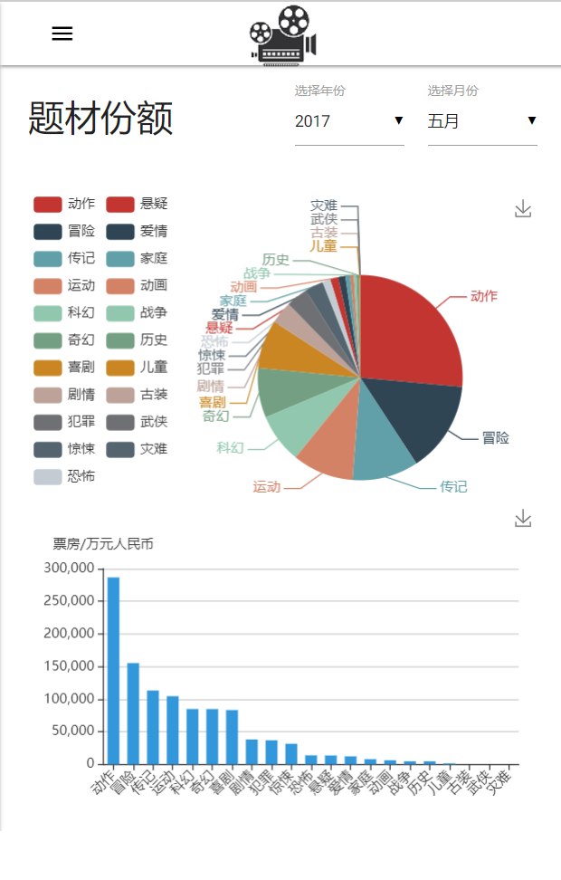
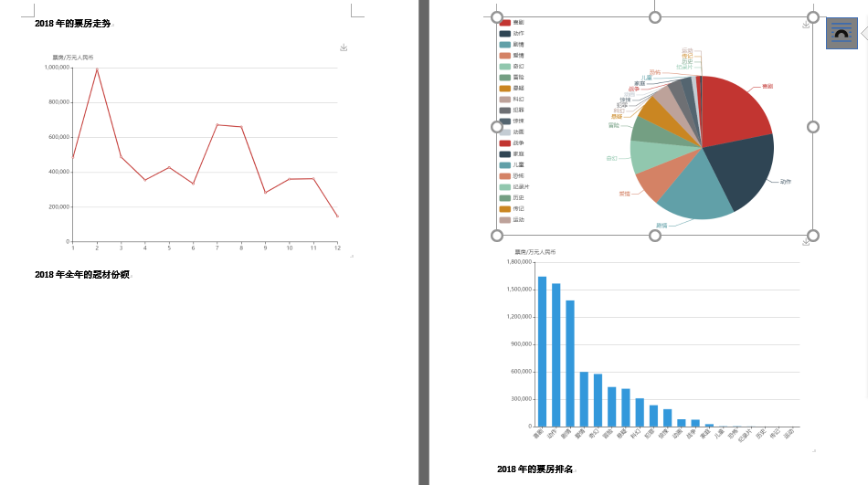

# 目录
[关于项目](#关于项目--皮划艇电影)  
[此发布版本的改进](#此发布版本的改进)  
[运行环境需求](#运行环境需求)  
[各部分功能简介](#各部分功能简介)  
[部署和使用指南](#部署和使用指南)  
[制作人员/项目分工](#制作人员项目分工拼音序)  
[许可证](#许可证)

# 关于项目--皮划艇电影

此项目为2018秋软件工程17组的课程项目。项目实现了一个简单的电影票房数据可视化系统，基于[Flask](http://flask.pocoo.org)、[jQuery](https://jquery.com)、[Materialize-UI](http://www.materializecss.cn/about.html)和[MySQL](https://www.mysql.com)构建，同时使用到了以下Python库：[PyMySQL](https://pypi.org/project/PyMySQL/)、[SQLAlchemy](https://www.sqlalchemy.org)、[Scrapy](https://scrapy.org/)、[BeautifulSoup](https://www.crummy.com/software/BeautifulSoup/)、[Pandas](http://pandas.pydata.org)，以及以下Javascript库：[WordExport](https://github.com/Kent-Su/jquerty-wordExport)。项目演示时所用的数据来自[电影票房](http://58921.com)和[猫眼专业版](https://piaofang.maoyan.com/dashboard)。请遵循以上各自的使用条款，勿将此项目作为商业用途。

# 此发布版本的改进
### 相对于此前在课上演示的版本，此发布版本有以下改进：
* 改进了生成报表界面`生成报表`和`强制刷新`两个按钮的观感：
	* 现在它们是真正的按钮了，且带有点击效果
* 在送出的请求里加上了`Keep-Alive`，同时改进了服务器端访问数据库的方式：
	* 现在整个系统的响应速度更快且更稳定
* 进一步改进了自适应显示机制，改善了页面在窄屏幕（主要是手机等移动设备）上的使用体验：



### 爬虫部分相对于此部分被检查时还有了如下改进：
* 增加一个爬取猫眼专业版每日票房的爬虫，现在票房数据是从猫眼获得的；
* 向58921爬虫添加增量更新数据的能力；
* 猫眼和58921的爬虫均具备直通数据库的能力，无需另外手动灌库。

# 运行环境需求
对OS没有硬性要求，能跑Python 3.7的都可以。
### 1. 服务器端：
MySQL数据库，需使用旧版验证机制；<br>
Python 3.7以及以下Python库：Flask、PyMySQL、SQLAlchemy、Pandas；<br>
任意一个稳定的Web服务器（如Nginx或Apache）。

### 2. 爬虫：
需要一个记住登录的Cookie；不一定需要运行于服务器端。<br>
Python 3.7以及以下Python库：Scrapy、SQLAlchemy、PyMySQL、Pandas、BeautifulSoup。

### 3. 网页端：
支持除IE外的任何主流浏览器。

# 各部分功能简介
### 1. 爬虫
该套爬虫提供的特性：
* 可以在系统在线时更新数据
* 可以增量更新（58921爬虫）

爬虫执行时的需求：
* （对于58921）需要登录了账号的有效Cookie：对此我们提供了转化工具

### 2. 查询服务器
* 基于`Flask`编写
* 默认运行于5000端口
* 使用`SQLAlchemy`连接数据库
* 使用`Pandas`做中间的运算处理
* 解析请求并访问数据库

### 3. 登录/注册服务
* 基于`Flask`编写
* 默认运行于3000端口
* 服务器存储明文用户名和MD5密码
* 登录时密码的传递采用“加盐”方法
* 只有登录后才能访问“生成报表”功能

### 4. 网页端
* 基于`Materialize-UI`和`JQuery`
* 单页式应用（SPA）
* 根据页面宽度改变布局（见前面图片）
* 使用`ECharts`图表，每个图表均支持单独的“另存为图片”功能

### 5. 生成报表
* 使用`WordExport`
* 生成为Word文档（.doc）
* 唯一需登录的功能，故登陆后径直去向此功能
* “所见即所得”，生成的Word文档和预览页面样式一致



# 部署和使用指南
### 1. Web端
出于稳定性考虑，建议使用成熟的Web服务器（`Nginx`或者`Apache`等）来分发页面。
1. 将网页放进Web服务器的根目录之前，您需要修改`WebPages`目录下的`server-config.js`，将您的服务器地址作为`SERVER_ADDRESS`的值；
2. 之后，将`WebPages`目录下全部内容复制进Web服务器的根目录，将服务器的首页设为`index.html`；
3. 启动您的Web服务。

### 2. 服务器
#### 0. 数据库的配置
该项目用到了5个库，分别为`PASSWORDS`、`cleaned_movie_data`、`boxing_day`、`boxing_genre`和`boxing_month`，在本说明中它们均位于库`se`内。其中前两个需要事先手动建立，建立这两张表的SQL语句如下：

（建立`PASSWORDS`）
```
create table PASSWORDS (
id INT(11),
username VARCHAR(255) NOT NULL,
password VARCHAR(255) NOT NULL,
vcode INT(11)
);
```

（建立`cleaned_movie_data`）
```
create table cleaned_movie_data (
name text not null,
boxing double not null,
year bigint,
month bigint,
day bigint,
director text,
actor text,
genre text
);
```

其余三张表中，`boxing_day`会在爬取猫眼数据时创建，另外两个则会在运行优化表脚本时创建，其操作详见“爬虫和数据更新”部分。

#### 1. 在开始运行服务器前，您应当完成如下步骤：
1. 修改`servers`目录下的数据库配置`server_config.py`，其中各字段含义如下：

	```
SQL_USERNAME='root' # 数据库的用户名
SQL_PASSWORD='hitse2018' # 数据库的密码
SQL_ADDRESS='139.199.75.35' # 数据库的地址
SQL_PORT='3306' # 数据库的端口号
SQL_SCHEMA='se' # 使用的数据库的名称（schema）
	```
2. 替换`servers`目录下`report.html`含有的服务器地址：

	对于Windows Server用户，请执行以下Powershell命令：

	```
(gc .\report.html) -replace '139.199.75.35', '你的服务器地址' | out-File report.html
	```
	对于Linux/Unix用户，请执行以下Shell命令：

	```
sed -i 's/139.199.75.35/您的服务器地址/g' ./report.html
	```

#### 2. 运行服务器：
在`servers`目录下执行`sh run_server.sh`，即可启动查询和登录服务器。您可以分别在`qsrv.log`和`lsrv.log`中查看它们的日志。

### 3. 爬虫和数据更新
准备脚本中，待补充
脚本需要替换现有数据库地址，用户，密码，库名等
#### 1. 58921爬虫的使用
该爬虫需要一个已经登录账号并选中“记住登录”项的Cookie。若在服务器获得Cookie不方便，此爬虫也可以在其他电脑上运行。运行前的需要的配置工作如下：
1. 在您的浏览器上访问58921.com并登录，登录时选中“记住登录”；
2. 打开开发人员工具，进入`Network`选项卡；
3. 刷新页面，从`Network`选项卡中找到请求头的Cookie，将其值复制；
4. 将整段Cookie粘贴到`spiders/cookie_tool.py`下的`mycookie`字段之后（记得加引号）；
5. 运行`python3 cookie_tool.py`，复制得到的输出，粘贴为`spiders/spider/server_config.py`里的`MY_COOKIE`字段；
6. 修改`server_config.py`里的数据库信息：（示例）

	```
SQL_USERNAME='root' # 数据库的用户名
SQL_PASSWORD='hitse2018' # 数据库的密码
SQL_ADDRESS='139.199.75.35' # 数据库的地址
SQL_PORT='3306' # 数据库的端口号
SQL_SCHEMA='se' # 使用的数据库的名称（schema）
	```

完成后，在`spiders/spider/`下执行`python3 main.py`即可开始爬取并更新数据库。

#### 2. 猫眼专业版爬虫的使用
修改`spiders/`下的`server_config.py`，将数据库信息写进文件：（示例）

```
SQL_USERNAME='root' # 数据库的用户名
SQL_PASSWORD='hitse2018' # 数据库的密码
SQL_ADDRESS='139.199.75.35' # 数据库的地址
SQL_PORT='3306' # 数据库的端口号
SQL_SCHEMA='se' # 使用的数据库的名称（schema）
```

设置妥当后，执行`python3 maoyanspider.py`开始爬取和更新数据库。

#### 3. 优化表的更新
为提高查询速度，本系统设2张优化表：`boxing_genre`和`boxing_month`，其更新应在爬虫执行完后进行。通过在`spiders/`下执行`python3 boxing_genre.py`和`python3 boxing_month.py`来更新这两张表。

# 制作人员/项目分工（拼音序）
廖儒：report.html及相关Javascript脚本；<br>
刘皓：登录服务器（loginserver）和服务器结构设计；<br>
龙瀚林：项目设计、index.html及相关Javascript脚本；<br>
刘颂唐：猫眼和58921爬虫；<br>
周瑞：查询服务器（queryserver）和优化表设计。

# 许可证
MIT License
